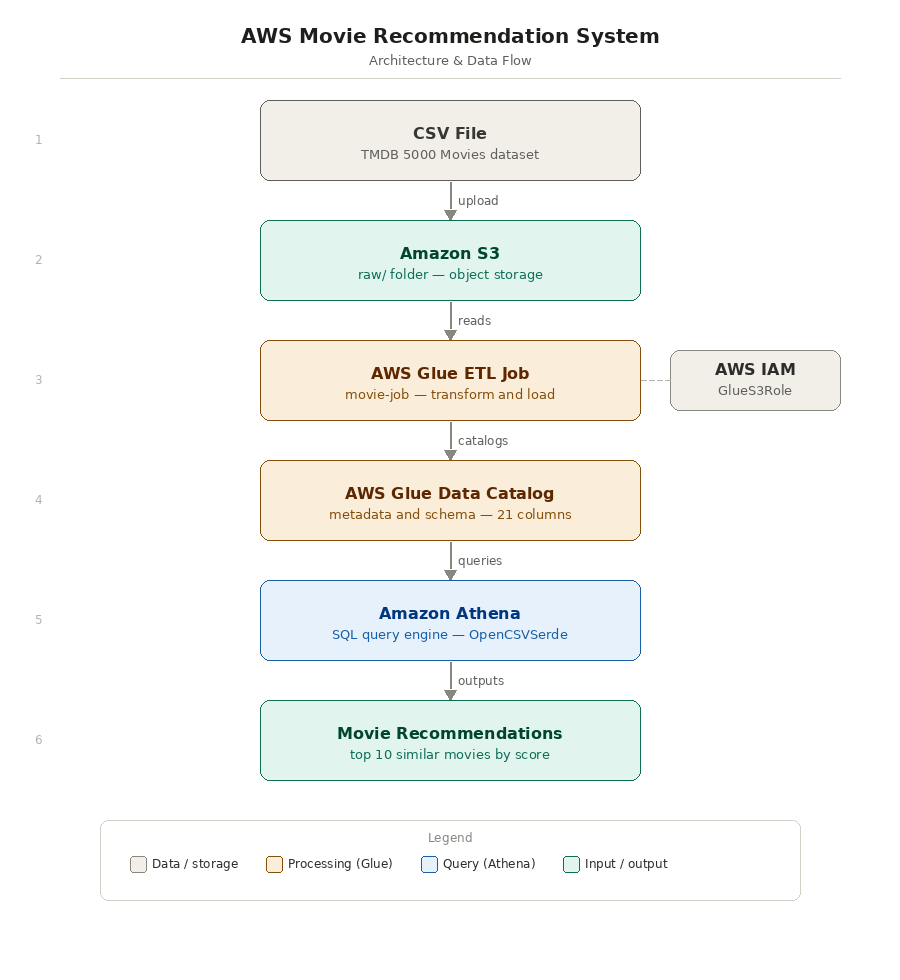

# Movie Recommendation System on AWS

A content-based movie recommendation system built entirely on AWS cloud services using the TMDB 5000 Movies dataset. Recommends similar movies based on matching genres and keywords using pure SQL — no machine learning required.

---

## Architecture



---

## AWS Services Used

| Service | Role |
|---|---|
| **Amazon S3** | Stores the raw CSV dataset in the `raw/` folder |
| **AWS Glue ETL** | Visual ETL pipeline (`movie-job`) to process and catalog data |
| **AWS Glue Data Catalog** | Auto-detected schema with 21 columns and correct data types |
| **Amazon Athena** | Serverless SQL query engine to run recommendation queries |
| **AWS IAM** | `GlueS3Role` to grant Glue permission to access S3 |
| **AWS CloudShell** | Used to inspect and clean bad files from S3 |

---

## Dataset

- **Source:** [TMDB 5000 Movies Dataset](https://www.kaggle.com/datasets/tmdb/tmdb-movie-metadata)
- **File:** `tmdb_5000_movies.csv`
- **Size:** ~5.4 MB
- **Records:** ~4800 movies
- **Key columns:** `title`, `genres`, `keywords`, `budget`, `revenue`, `vote_average`, `popularity`

---

## How It Works

The recommendation system works by:

1. Taking a target movie (e.g. Avatar)
2. Extracting its genres and keywords
3. Scoring every other movie based on how many genres and keywords match
4. Returning the top 10 highest scoring movies

```sql
SELECT title, vote_average, release_date,
    (
      CASE WHEN genres   LIKE '%Action%'          THEN 1 ELSE 0 END +
      CASE WHEN genres   LIKE '%Science Fiction%' THEN 1 ELSE 0 END +
      CASE WHEN keywords LIKE '%space%'           THEN 1 ELSE 0 END +
      CASE WHEN keywords LIKE '%alien%'           THEN 1 ELSE 0 END
      -- ... more genre/keyword matches
    ) AS similarity_score
FROM movies_data
WHERE title != 'Avatar'
HAVING similarity_score >= 2
ORDER BY similarity_score DESC, CAST(vote_average AS DOUBLE) DESC
LIMIT 10;
```

---

## Sample Output — Recommendations for Avatar

| Rank | Movie | Similarity Score | Rating |
|---|---|---|---|
| 1 | Star Trek Into Darkness | 6 | 7.4 |
| 2 | The Fifth Element | 6 | 7.3 |
| 3 | Independence Day | 6 | 6.7 |
| 4 | Starship Troopers | 6 | 6.7 |
| 5 | Ender's Game | 6 | 6.6 |
| 9 | The Empire Strikes Back | 5 | 8.2 |
| 10 | Star Wars: Clone Wars | 5 | 8.0 |

---

## Project Files

| File | Description |
|---|---|
| `queries.sql` | All Athena SQL queries used in this project |
| `aws_architecture_diagram.png` | Architecture flow diagram |
| `movie_reco_aws_project.docx` | Full project documentation with screenshots |

---

## Key Challenges & Fixes

| Problem | Fix |
|---|---|
| `HIVE_BAD_DATA` Parquet errors | Deleted stray `.txt` files from S3 via CloudShell |
| Table pointing to entire bucket root | Recreated table pointing to `raw/` folder only |
| JSON-inside-CSV breaking column parsing | Switched to `OpenCSVSerde` with proper quote/escape settings |
| `COLUMN_NOT_FOUND` in HAVING clause | Repeated full `CASE WHEN` expression in both SELECT and HAVING |

---

## Setup Instructions

### Prerequisites
- AWS account
- S3 bucket with the TMDB CSV file uploaded to a `raw/` folder
- Amazon Athena configured with a workgroup

### Steps

1. Upload `tmdb_5000_movies.csv` to `s3://your-bucket/raw/`
2. Open Amazon Athena Query Editor
3. Create a database: `CREATE DATABASE movies_db;`
4. Run the `CREATE EXTERNAL TABLE` query from `queries.sql`
5. Run the recommendation query with your chosen movie

---

## Author

**Riya Kalokhe**  
AWS Region: Asia Pacific (Mumbai)  
Date: May 2026
